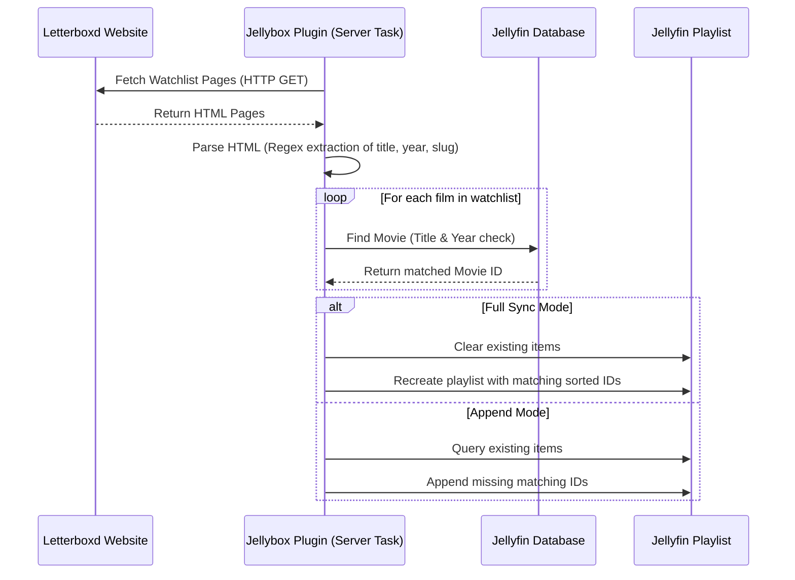

---
tags:
  - jellybox
  - overview
  - letterboxd
  - jellyfin
  - architecture
---

# Project Overview: Jellybox 🌟

**Jellybox** is a comprehensive synchronization bridge designed to connect self-hosted media servers (**Jellyfin**) with movie-tracking networks (**Letterboxd**). 

The initial core of this project is based on the **Letterboxd Watchlist Sync Plugin**, which automates matching a user's public watchlist on Letterboxd directly to their Jellyfin playlist.

---

## 🎯 Primary Purpose

1. **Automation**: Remove the manual effort of maintaining a Jellyfin playlist that mirrors movies you want to watch on Letterboxd.
2. **Fuzzy Matching**: Provide a reliable lookup mechanism that correlates Letterboxd web metadata (titles, years, slugs) to local media files that may have slightly different naming conventions.
3. **Flexible Synchronization**: Permit users to choose between:
   - **Append Mode**: Safely adding new movies to their playlists without ever deleting items.
   - **Full Sync Mode**: Mirroring their watchlist exactly, automatically removing items once they are watched or deleted on Letterboxd.

---

## 🔄 How the Sync Workflow Works

The core synchronization routine follows a 4-step workflow:

---

## 🛠️ Tech Stack & Constraints

- **Language & Runtime**: C# targeting `.NET 10.0` (with preview compatibility for `.NET 11.0`).
- **Jellyfin SDK**: References version `10.11.8` controllers, models, and databases.
- **Scraping Model**: Direct HTTP client queries with custom regex patterns. This is lightweight but fragile (requires vigilance for Letterboxd UI updates).

Next, explore the [[Technical Architecture]] to see how this workflow is implemented in C# classes.
