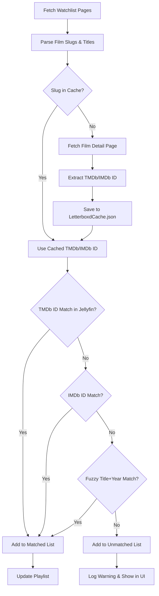

---
tags:
  - jellybox
  - decisions
  - specifications
  - tmdb
  - matching
  - ui
---

# Design Decisions: Jellybox v2 🧭

This document captures the agreed-upon design decisions from our project planning session. These serve as the binding specification for the next development iteration.

---

## 🎯 Project Scope

| Question | Decision |
|---|---|
| **Ultimate goal** | Focus on extending the Letterboxd Sync plugin with deeper Letterboxd-specific integrations (custom lists, likes, metadata-accurate matching). |
| **Multi-service support (Trakt, AniList, etc.)** | Out of scope for now. Letterboxd-only. |
| **Multi-user support** | Out of scope for now. Single Letterboxd username → single Jellyfin user. |
| **Custom Letterboxd lists** | Out of scope for now. Watchlist-only. |

---

## 🏗️ Priority #1: Robust Metadata Matching

### ID Resolution Strategy
- **Source**: Scrape each film's detail page (`/film/{slug}/`) on Letterboxd to extract TMDb and/or IMDb IDs from the page markup.
- **Rate-Limiting Protection**: Use **Hybrid Scraping with Local Caching** — only fetch the detail page for *new* items not yet in the cache.
- **Cache Storage**: A separate **`LetterboxdCache.json`** file stored in the plugin's data directory (`ApplicationPaths.PluginConfigurationsPath`).

### Matching Priority Chain
The matching engine will use a **cascading fallback** strategy:

```
1. TMDb ID match      → Best accuracy, most Jellyfin libraries use TMDb
2. IMDb ID match      → Fallback if TMDb ID is unavailable
3. Fuzzy title + year → Last resort, using existing normalization logic
```

> [!IMPORTANT]
> The existing fuzzy title+year matching is **preserved as a graceful fallback**, not removed.

---

## ⚙️ Sync Configuration

| Setting | Decision |
|---|---|
| **Default interval** | 12 hours (unchanged) |
| **Configurable interval** | Yes — dropdown in config page: `1h`, `6h`, `12h`, `24h` |
| **Sync modes** | Keep both: `Append Only` and `Full Sync` |
| **Manual trigger** | Add a **"Sync Now"** button to the config page |

---

## 🎨 Config Page UI Enhancements

- **Sync Results Panel**: Add a "Matched / Unmatched" summary section directly in the existing config page with expandable details showing:
  - Film title & year
  - Matched Jellyfin item (or "Not Found")
  - Resolved TMDb/IMDb ID
- **Sync Now Button**: Trigger the scheduled task on-demand from the config page via the Jellyfin API.
- **Configurable Interval Dropdown**: Replace the hardcoded 12-hour trigger with a user-selectable interval.

---

## 📋 Implementation Summary



For the technical implementation, see [[Technical Architecture]].
For the full project context, see [[Project Overview]].
