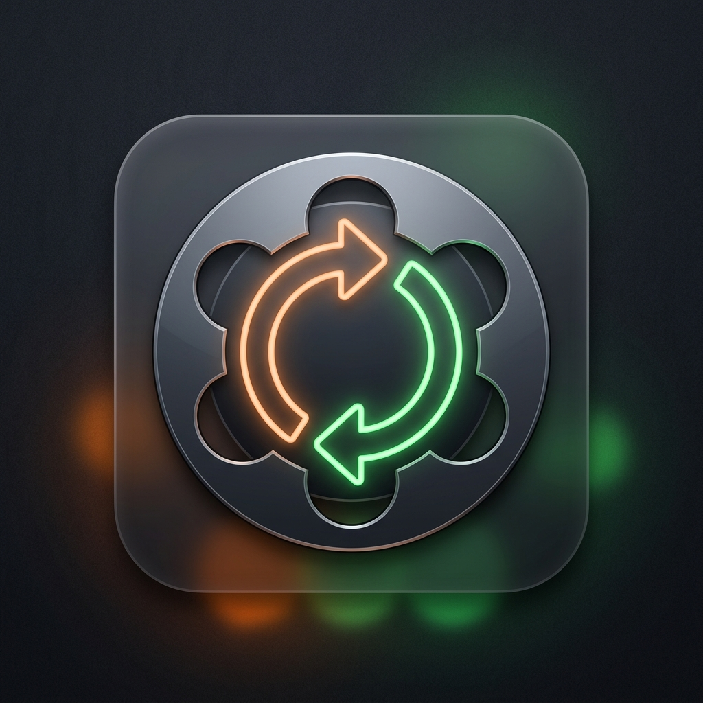

# Jellyfin Letterboxd Watchlist Sync Plugin

<p align="center">
  
</p>

[](https://jellyfin.org)
[](https://dotnet.microsoft.com)
[](https://dotnet.microsoft.com)

A server-side plugin for **Jellyfin** (10.10.x+) that automatically synchronizes a user's public **Letterboxd watchlist** to a Jellyfin playlist. 

The sync task runs in the background at regular intervals (or can be triggered manually), matching movies in your Letterboxd watchlist to your Jellyfin library using normalized title-matching and production years.

---

## Features

- 🔄 **Automatic Scheduled Sync:** Syncs your watchlist automatically every 12 hours (configurable).
- 👥 **Multi-User Support:** Choose which Jellyfin user the playlist should belong to.
- ⚙️ **Two Sync Modes:**
  - **Append Only:** Only adds new movies from your Letterboxd watchlist to your playlist; no items are ever removed.
  - **Full Sync:** Recreates the playlist to match your Letterboxd watchlist exactly (removes watched/deleted items and maintains the correct order).
- 🧩 **Fuzzy Matching:** Smart matching system that normalizes titles (removes special characters/casing) and validates the production year using Letterboxd slugs.
- 🎨 **Modern Config UI:** A premium, glassmorphism-styled dashboard page integrated directly into your Jellyfin administration panel.

---

## Installation

You can install this plugin either via the **Jellyfin Plugin Catalog** (recommended) or **manually**.

### Option A: Install via Plugin Catalog (Repository)
1. Go to your Jellyfin server **Dashboard** -> **Plugins**.
2. Select the **Repositories** tab and click **Add**.
3. Enter a name (e.g., `Letterboxd Watchlist Sync`) and paste the raw `manifest.json` URL of your hosted repository:
   ```
   https://raw.githubusercontent.com/bozer00/jellyfin-plugin-letterboxd-sync/main/manifest.json
   ```
4. Click **Save**.
5. Switch to the **Catalog** tab. Find **Letterboxd Watchlist Sync** under the *Playlists* category, click on it, and click **Install**.
6. Restart your Jellyfin server.

### Option B: Manual Installation
1. Download the compiled `Jellyfin.Plugin.LetterboxdSync.dll` file.
2. Navigate to your Jellyfin server's `plugins` directory:
   - **Windows:** `C:\ProgramData\Jellyfin\Server\plugins\`
   - **Docker:** your mapped `/config/plugins/` directory
3. Create a folder named `LetterboxdSync` and paste the `Jellyfin.Plugin.LetterboxdSync.dll` inside it.
4. Restart your Jellyfin server.

---

## Configuration

1. In the Jellyfin Web UI, navigate to **Dashboard** -> **Plugins** -> **Installed**.
2. Click on **Letterboxd Sync** to open its settings page.
3. Configure the following fields:
   - **Letterboxd Username:** Enter your public Letterboxd username.
   - **Sync to User:** Select which Jellyfin user's library and playlist layout to sync against.
   - **Playlist Name:** Enter the target playlist name (default: *Letterboxd Watchlist*).
   - **Sync Mode:** Choose between *Append Only* or *Full Sync*.
4. Click **Save Settings**.

---

## How It Works

1. **Letterboxd Scraping:** The plugin sends standard HTTP requests page-by-page to `https://letterboxd.com/USERNAME/watchlist/` (requires your watchlist to be set to **Public**).
2. **Parsing:** It parses the server-side rendered HTML using lightweight regex queries to extract:
   - Film URL slug (e.g. `parasite-2019`)
   - Film title (from the poster image `alt` text, e.g. `Parasite`)
   - Production year (extracted from the slug if it ends in a 4-digit number)
3. **Fuzzy Matching:**
   - It searches your library for a movie matching the exact title and production year.
   - If not found, it removes special characters and casing (e.g., `Léon: The Professional` -> `leontheprofessional`) to perform a normalized search across your movie files.
4. **Playlist Management:** It either appends new matching items to your playlist or overwrites/recreates the playlist for a clean synchronisation (Full Sync), updating the Jellyfin library database directly.

---

## Development & Building

The project is built using **.NET 8.0** compatibility for the Jellyfin 10.10.x API.

### Build Locally
To build the plugin on your computer, ensure you have the **.NET SDK (8.0, 9.0, or 10.0)** installed:
```powershell
dotnet build -c Release -o ./build
```

### Build with Docker
If you do not have the .NET SDK installed locally but have Docker running:
```powershell
docker run --rm -v "${PWD}:/src" -w /src mcr.microsoft.com/dotnet/sdk:8.0 dotnet build -c Release -o ./build
```
