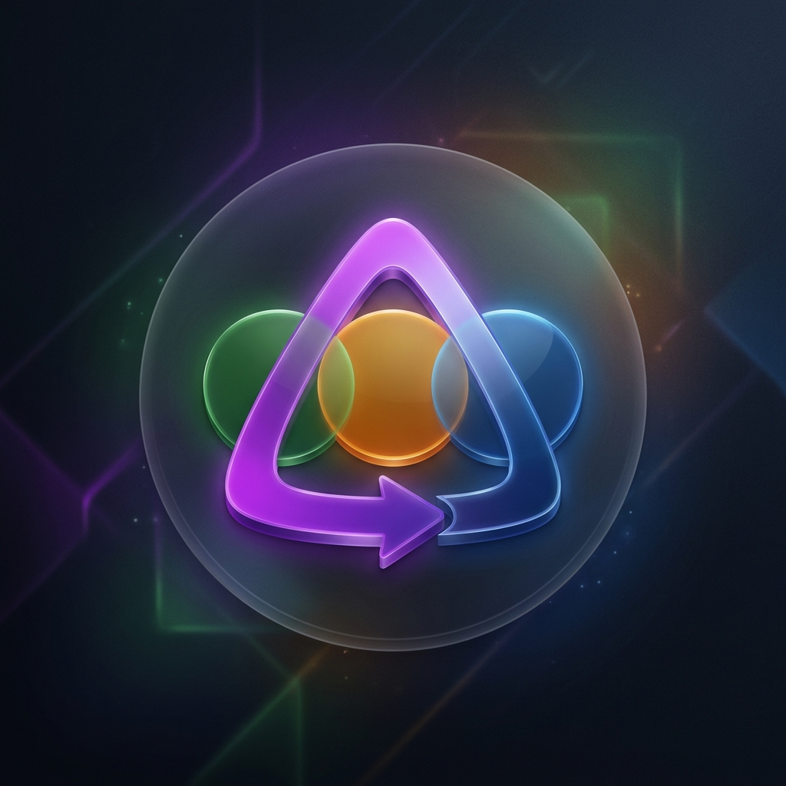

# Jellybox — Jellyfin × Letterboxd Integration Suite

<p align="center">
  
</p>

[](https://jellyfin.org)
[](https://dotnet.microsoft.com)
[](https://dotnet.microsoft.com)

A collection of server-side plugins for **Jellyfin** (10.11.x+) that integrates **Letterboxd** features directly into your media server.

---

## Plugins in this Repository

This repository contains three independent plugins:

1.  [Letterboxd Watchlist Sync](#1-letterboxd-watchlist-sync) — Automatically synchronize a user's public Letterboxd watchlist to a Jellyfin playlist.
2.  [Letterboxd Ratings](#2-letterboxd-ratings) — Fetch average community ratings from Letterboxd and apply them to movie items in your library.
3.  [Letterboxd Watched Sync](#3-letterboxd-watched-sync) — Automatically mark movies as watched in Jellyfin based on a public Letterboxd watched history.

---

## 1. Letterboxd Watchlist Sync

A scheduled background task plugin that synchronizes a user's watchlist using TMDb/IMDb ID resolution.

### Features
-   🔄 **Automatic Scheduled Sync:** Syncs watchlist automatically at a configurable interval (1h, 6h, 12h, or 24h).
-   🎯 **Smart Metadata Matching:** Three-tier matching engine (TMDb ID -> IMDb ID -> Fuzzy Title + Year fallback).
-   💾 **Local ID Cache:** Resolved TMDb/IMDb mappings are cached locally (`LetterboxdCache.json`) to avoid redundant requests.
-   ⚙️ **Two Sync Modes:**
    -   *Append Only:* Only appends new items; no items are ever removed.
    -   *Full Sync:* Re-creates the playlist to match the Letterboxd watchlist exactly (removes watched/deleted items and maintains correct order).
-   🎨 **Modern Config UI:** A premium, glassmorphism-styled dashboard page featuring a "Sync Now" button and match summary statistics.

---

## 2. Letterboxd Ratings

A metadata provider plugin that fetches average community ratings from Letterboxd and integrates them into your Jellyfin movie metadata.

### Features
-   ⭐ **Aggregate Ratings:** Scrapes the global average rating for movies (e.g., `4.13 out of 5`) directly from Letterboxd.
-   ⚙️ **Flexible Mapping:** Configure where the ratings are saved in Jellyfin's metadata:
    -   `Community`: Maps the score on a 10-point scale (e.g., `4.13` -> `8.26` Community Rating).
    -   `Critic`: Maps the score on a 100-point scale (e.g., `4.13` -> `83%` Critic Rating).
    -   `Both`: Applies the rating to both fields.
-   🔒 **Local Cache:** Scraped ratings are cached locally (`LetterboxdRatingsCache.json`) and kept for 14 days, preventing redundant network requests.
-   🚦 **Rate Limiting & request serialization:** Uses a thread-safe semaphore and a mandatory 1.5-second delay between outgoing requests to prevent IP bans.

---

## 3. Letterboxd Watched Sync

A scheduled background task plugin that parses a user's public Letterboxd watched history and marks matched movies as played in Jellyfin.

### Features
-   🔄 **Automatic Scheduled Sync:** Syncs played status automatically at a configurable interval (1h, 6h, 12h, or 24h).
-   🎯 **Smart Metadata Matching:** Three-tier matching engine (TMDb ID -> IMDb ID -> Fuzzy Title + Year fallback).
-   💾 **Local ID Cache:** Resolved TMDb/IMDb mappings are cached locally (`LetterboxdWatchedCache.json`) to avoid redundant requests.
-   ⚠️ **Safety First:** If no Jellyfin user is configured, the task aborts and logs a warning rather than modifying playstates for a default profile.
-   🎨 **Modern Config UI:** A premium, glassmorphism-styled dashboard page featuring a "Sync Now" button, match summary statistics, and an unmatched films grid (capped at 200 items).

---

## Installation

You can install either plugin via the **Jellyfin Plugin Catalog** or **manually**.

### Option A: Install via Plugin Catalog
1.  Go to your Jellyfin server **Dashboard** -> **Plugins**.
2.  Select the **Repositories** tab and click **Add**.
3.  Enter a name (e.g., `Jellybox`) and paste the raw repository `manifest.json` URL:
    ```
    https://raw.githubusercontent.com/bozer00/jellyfin-plugin-letterboxd-sync/main/manifest.json
    ```
4.  Click **Save**.
5.  Switch to the **Catalog** tab. Find **Letterboxd Watchlist Sync** or **Letterboxd Ratings** in the catalog, click on them, and click **Install**.
6.  Restart your Jellyfin server.

### Option B: Manual Installation
1.  Download the compiled `.dll` file from the repository releases:
    -   `Jellyfin.Plugin.LetterboxdSync.dll` for the Watchlist Sync.
    -   `Jellyfin.Plugin.LetterboxdRatings.dll` for Ratings.
    -   `Jellyfin.Plugin.LetterboxdWatchedSync.dll` for Watched Sync.
2.  Navigate to your Jellyfin server's `plugins` directory.
3.  Create subdirectories `LetterboxdSync`, `LetterboxdRatings`, and `LetterboxdWatchedSync` respectively and paste the corresponding `.dll` inside them.
4.  Restart your Jellyfin server.

---

## Configuration

### Watchlist Sync Configuration
1.  Navigate to **Dashboard** -> **Plugins** -> **Installed** and click **Letterboxd Sync**.
2.  Configure your Letterboxd Username, Sync to User, Playlist Name, Sync Mode, and Sync Interval.
3.  Click **Save Settings**, or optionally click **Sync Now** to run an immediate sync.

### Ratings Configuration
1.  Navigate to **Dashboard** -> **Plugins** -> **Installed** and click **Letterboxd Ratings**.
2.  Configure the **Letterboxd Rating Mapping** option (`Community`, `Critic`, or `Both`).
3.  Click **Save Settings**.
4.  Go to **Dashboard** -> **Libraries**, click on your Movies library options, and in the **Metadata downloaders** section, make sure **Letterboxd Ratings** is checked. Place it in your preferred order priority.
5.  Run a metadata refresh on your library to populate the ratings.

### Watched Sync Configuration
1.  Navigate to **Dashboard** -> **Plugins** -> **Installed** and click **Letterboxd Watched Sync**.
2.  Configure your Letterboxd Username, Jellyfin User, and Sync Interval.
3.  Click **Save Settings**, or optionally click **Sync Now** to run an immediate sync.

---

## Building Locally

The projects target **.NET 9.0** and require the .NET SDK.

To build all plugins and package them into ZIP archives, run the automated build script:
```bash
./build.sh
```

Alternatively, to compile individual projects:
```bash
dotnet build -c Release LetterboxdSync/LetterboxdSync.csproj
dotnet build -c Release LetterboxdRatings/LetterboxdRatings.csproj
dotnet build -c Release LetterboxdWatchedSync/LetterboxdWatchedSync.csproj
```
